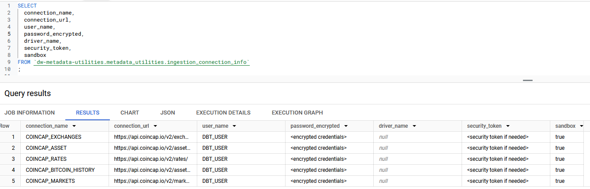
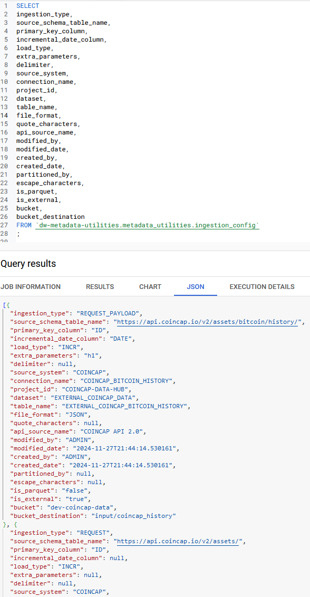
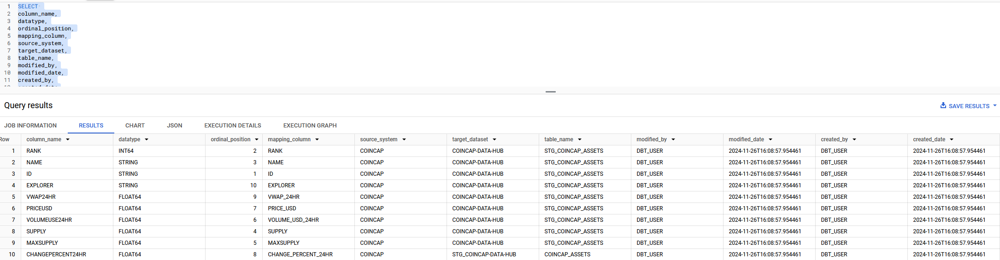
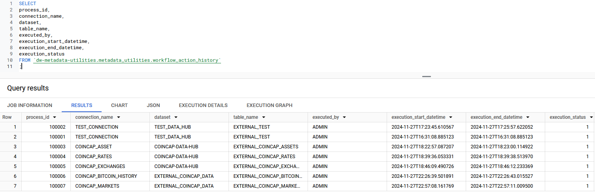

## Intro
The goal of this project repository is to build a framework to support automated data collection leveraging GCP storage & Bigquery.

## Bigquery Metadata Utility Objects

Currently, the Framework is relying on a handful of internal tables in BigQuery.

**INGESTION_CONNECTION_INFO**
This table will hold the connection information for the endpoints

**INGESTION_CONFIG** 
This table contains data/table ingestion configurations such as ingestion type, primary key, incremental or full data load, delimiter, file type etc.

**INGESTION_COLUMN_DETAILS**
This table contains column details for the data that is being ingested such as column names, data types, ordinal positions, target table

**WORKFLOW_ACTION_HISTORY**
This table contains an audit log  with connection_name, start, end and status for each data ingestion workflow that is executed.
TODO: Add column containing the bucket storage path for the execution log

**CHANGE_EVENT**
TBD...

## Data Ingestions: 

**What is CoinCap?**

CoinCap is a useful tool for real-time pricing and market activity for over 1,000 cryptocurrencies. By collecting exchange data from thousands of markets, we are able to offer transparent and accurate data on asset price and availability. 

CoinCap Documentation: [https://docs.coincap.io/#d8fd6001-e127-448d-aadd-bfbfe2c89dbe](https://docs.coincap.io/#intro)

** TBD **

Looking into additional sources I can use to flesh out this project. 

### Parser details

**Description: The data will be first loaded to a Flat File**

* **-s:** The section name of configuration file, which will be used to get the object information.

* **-a:** The asset name which will be used to get the object information.

* **-l:** Logging level, "info" by default.
    * info
    * debug
    * warning
    * error

* **-p:** The configuration file to be used. If not specified, the program will try to find it with "./config.ini"

* **--print_log:** Whether print the log to console. False by default

### Example Data Ingestion Executions:

* **Crypto Asset data:** python3 controller.py -s COINCAP_ASSET -a EXTERNAL_COINCAP_ASSETS -l info

* **BITCOIN ASSET HISTORY:** python3 controller.py -s COINCAP_BITCOIN_HISTORY -a EXTERNAL_COINCAP_BITCOIN_HISTORY -l info

* **CRYPTO EXCHANGE DATA:** python3 controller.py -s COINCAP_EXCHANGES -a EXTERNAL_COINCAP_EXCHANGES -l info

* **CRYPTO COIN RATES:** python3 controller.py -s COINCAP_RATES -a EXTERNAL_COINCAP_RATES -l info

* **CRYPTO MARKETS DATA:** python3 controller.py -s COINCAP_MARKETS -a EXTERNAL_COINCAP_MARKETS -l info

### TODO: 
* Upload data to respective GCP Bucket 
* Upload Log to GCP metadata bucket after job execution
* Create External Table
* Add functionality to create internal tables
* Add functionality to update incremental storage tables
* Add change_event log to record pre/post changes on column level
