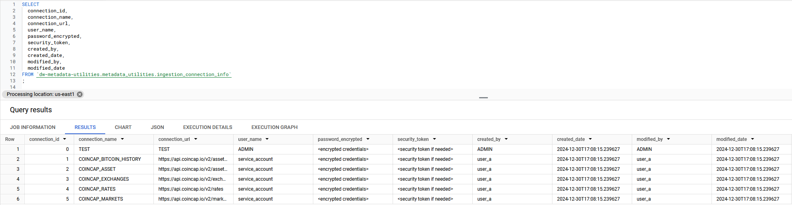

## Prerequisites

1. **Python Modules**
    * pandas==2.23
    * google-cloud-core==2.4.1
    * google-api-core==2.21.0
    * pycryptodome==3.21.0

2. GCP Account (Free trial is offered)
    * Create a BigQuery Project for Metadata.
    * Create bucket for Metadata project
    * Create a Service Account for Metadata Project
    * Generate a keyfile Metadata Project

3. CoinCap API Key
    * To Generate API key refer to: <a href="https://docs.coincap.io/#intro" target="_blank">CoinCap - Documentation</a> 


## Intro
The goal of this project repository is to build an application framework to support automated data collection leveraging GCP storage & Bigquery.

## Bigquery Metadata Utility Objects

The automation is utilizing a handful of BigQuery tables in the `dw-metadata-utilites` project which holds the dataset `metadata-utilities`.
A user will enter data source connection information, data ingestions configuration, and column details into the SQL tables. The user can then execute the 
python controller script with the required data ingestion arguements which help identify the source we are accessing for data extraction. The controller 
script will then pull the required data ingestion details from the `metadata-utilities` tables and begin extraction from the data source, writing 
the data into the target GCP storage.

As the controller script runs, a log file is generated detailing each action taken by the controller script. As well as the Start & End datetimestamps of the workflow 
execution which is recorded in the `workflow_action_history` table with a unique `process_id` for each job execution.

**ER Diagram:**


**INGESTION_CONNECTION_INFO**
This table will hold endpoint connection information as well as encrypted credentials



**INGESTION_CONFIG** 
The Ingestion Config table contains data/table ingestion configurations such as ingestion type, primary key, incremental or full data load, delimiter, file type etc.


**INGESTION_COLUMN_DETAILS**
The Ingestion Column Details table contains column details for the data that is being ingested such as column names, data types, ordinal positions, target table


**WORKFLOW_ACTION_HISTORY**
The Workflow Action History table contains an audit log of all workflow actions including connection_name, Start & End datetimestamps and the Workflow Status for each data 
ingestion workflow that is executed.

| Interpretation | Status |
|----------------|--------|
| In-Progress    | 0      |
| Complete       | 1      |
| Failed         | -1     |


**CHANGE_EVENT**
TBD...

## Data Ingestions: 

**CoinCap**

CoinCap is a useful tool for real-time pricing and market activity for over 1,000 cryptocurrencies. By collecting exchange data from thousands of markets, we are able to offer
transparent and accurate data on asset price and availability. 

CoinCap: <a href="https://docs.coincap.io/#intro" target="_blank">CoinCap - Documentation</a>

**TBD**

Looking into additional sources I can use to flesh out this project. 


### Parser details

**Description: The data will be first loaded to a Flat File**

* **-s:** The section name of configuration file, which will be used to get the object information.

* **-a:** The asset name which will be used to get the object information.

* **-l:** Logging level, "info" by default.
    * info
    * debug
    * warning
    * error

* **-p:** The configuration file to be used. If not specified, the program will try to find it with "./config.ini"

* **--print_log:** Whether print the log to console. False by default


### Example Data Ingestion Executions:

* **Crypto Asset data:** 
``` 
python3 controller.py -s COINCAP_ASSET -a EXTERNAL_COINCAP_ASSETS -l info 
```


* **BITCOIN ASSET HISTORY:** 
```
python3 controller.py -s COINCAP_BITCOIN_HISTORY -a EXTERNAL_COINCAP_BITCOIN_HISTORY -l info
```

* **CRYPTO EXCHANGE DATA:** 
```
python3 controller.py -s COINCAP_EXCHANGES -a EXTERNAL_COINCAP_EXCHANGES -l info
```

* **CRYPTO COIN RATES:** 
```
python3 controller.py -s COINCAP_RATES -a EXTERNAL_COINCAP_RATES -l info
```

* **CRYPTO MARKETS DATA:** 
```
python3 controller.py -s COINCAP_MARKETS -a EXTERNAL_COINCAP_MARKETS -l info
```

### TODO: 
* ~~Upload data to respective GCP Bucket~~ 
* ~~Upload Log to GCP metadata bucket after job execution~~
* ~~Archive Legacy data file.~~
* ~~Add functionality to create external table.~~
* ~~Add functionality to create internal tables.~~
    * ~~Staging Table with Ingestion column details~~ 
    * ~~Reference Tables with DW Created Datetime & Load Datetime~~
* ~~Add functionality for Full data load on Reference Table.~~
* Add functionality for Incremental data load on Reference Tables.
* Add Change Event metadata log to record pre/post changes on column level.

